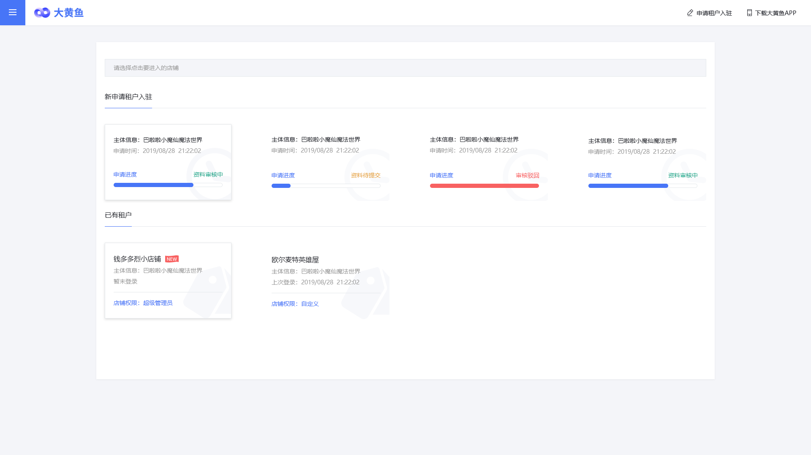

>### 租户登录页面

**功能设计**  
用户可浏览群商官网大黄鱼主页，通过“租户后台”入口转入租户后台用户登录页面。也可直接使用租户后台地址进入租户后台的登录页面。登录页面如下图所示：

(点击图像查看大图)
  
  * 租户登录页面是大黄鱼租户后台的实际的首页
  * 页面提供大黄鱼App扫码登录功能。登录二维码有时效，超时后显示“失效”状态： 
  

  
  
  

  * 扫码登录失败时，页面须显示“失败”状态：
  

  

  * 页面提供账号密码登录功能，用户使用大黄鱼账号密码进行登录。用户可选择使用扫码登录或输入账号登录； 
  
(点击图像查看大图)
  
  * **大黄鱼登录账号通常是账号注册的手机号码**。登录页面提供“手机号+密码”和“手机号+验证码”两种验证方式，用户可切换：
  

  

  * 对于没有大黄鱼账号的用户，页面提供账号注册入口；
  * 页面提供“申请租户入驻”入口；
  * 页面提供下载大黄鱼App入口。用户也可以通过App进行账号注册操作。点击（或鼠标悬停）在该入口上，显示App下载二维码，用户通过手机扫码直接下载： 
  

  
  

* 在登录页面中用户点击“立即注册”标签，显示大黄鱼账号注册页面。

(点击图像查看大图)
   

  * 用户须以手机号作为注册账号；
  * 用户输入手机号后，须拖动滚动条验证非机器爬虫操作。通过验证后方可获取手机短信验证码；
  * 发送手机验证码短信前，应判断手机号是否已注册或绑定大黄鱼账号。若手机号已注册大黄鱼账号，应拒绝发送短信，返回并呈现“手机号已注册”错误消息；
  * 若手机验证码5分钟内请求大于3次，应拒绝发送验证码短信，返回并呈现“获取验证码太频繁，请稍后再试。”信息。3分钟后可再次接受请求。一次验证码有效期5分钟；
  * 注册账号需要用户输入密码。两次输入密码值不一致时需提醒用户；
  * 用户须勾选平台服务协议等法律文件复选框方可点击“注册”按钮。法律文件名标签可点击，点击后呈现法律文件文本页面；
  * 点击“注册”按钮时须检查所有必须字段是否都正确填写内容。提交注册信息进行用户注册；
  * 注册结果应返回并呈现给用户，注册失败时应显示简短的失败原因。
* 用户成功登录后，视账号状态跳转逻辑如下：
  * 如果用户没有申请过任何租户账号，直接转入[租户申请](入驻申请.md)-租户信息录入页面；
  * 如果用户已有（绑定）租户账号或提交了一个以上申请且申请已进入审核状态，则显示如下页面：
  
(点击图像查看大图)
   
    * 此页面中将呈现所有当前用户已获批准的租户账号条目，显示于“已有租户”列表中。每一个租户条目包含：租户名称、主体信息、最后登录时间、当前用户在该租户账号中的权限等信息。点击条目将转入该租户账号对应的“[*租户首页*](zh首页.md)”；
    * 租户申请资料在“资料审核中”、“资料待提交”、“审核驳回”等状态的租户申请条目显示于“新申请租户入驻”列表区域。每个条目显示内容包括：主体信息、申请时间、申请状态以及表示申请进度的进度条。点击条目将转入对应申请记录的租户信息录入页面，**与新申请不同之处是：租户信息录入页面中各字段均填入用户已提交的内容。状态为“审核中”的申请记录内容不可修改；其它状态的申请记录内容可修改，并提供重新提交申请的按钮。**
* 在登录页面顶部点击“申请租户入驻”入口时，显示租户申请页面。
#### [租户入驻申请](入驻申请.md)