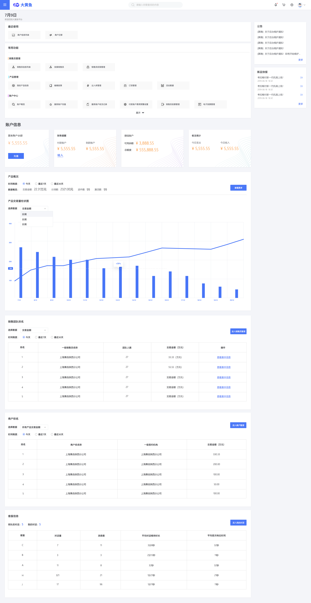

>### 租户后台首页

在租户后台，用户成功登录一个租户账号后页面显示租户后台首页。首页内容根据租户账号的状态不同而不同。  
* **已代理产品的租户后台首页**  

(点击图像查看大图)
  
  * 租户后台首页与其它功能页面不同，此页不显示左侧菜单；
  * 根据租户员工账号权限的不同，**本页面各部分内容根据权限显示或隐藏**。比如仅有租户超级用户账号和财务人员角色账号可查看“账户信息”内容。租户员工账号角色及其权限由租户超级用户账号在其[账号管理](zh账号管理.md)页面中配置；
  * 页面左上角显示当前日期信息；
  * 页面最上方面板显示“最近使用”的后台功能按钮。这些按钮根据用户最后打开的功能页动态显示和排序，最后使用的显示于最前端。最多显示4个。点击这些按钮将直接转入对应功能页面；
  * 第二个面板显示“常用功能”，显示了租户后台各子模块中最常用的功能模块快捷入口。点击这些按钮将直接转入对应功能页面。此面板可展开和收缩。功能入口条目按效果图所示条目进行开发；
  * 第三部分显示了租户的账户信息。包括租户服务户、付款户、收款户、授信户等记账账户的余额信息，当日收支统计等。服务账户提供充值功能入口、付款账户提供资金转入入口、授信账户提供还款入口；
  * 第四部分显示了租户代理产品营销概况数据图表。租户可选择产品，指定数据统计时间维度（7日、30日、年）以及统计数据名（支付类产品：**交易金额**、**分润金额**、**进件数**、**激活数**；普通商品：**销售量**、**销售额**）。数据以曲线图显示，用户在曲线上移动鼠标时须显示对应时间点上的数据详情标签。点击“查看更多”按钮将转入租户后台营销数据子功能页面；
  * 第五部分显示了租户下属一级销售员及其团队（所有下级销售员）的信息。用户可选择统计数据名（**销售量**或**交易额**）及统计时间维度（7日、30日、年）对销售团队进行排名，以获取最直观的团队贡献度数据。点击“查看基本信息”可转入一级销售员详细信息页面。点击“进入销售员管理”按钮则转入租户后台[销售员管理](zh销售员管理.md)子模块主页；
  * 第六部分显示了租户销售的所有支付机具进件商户的信息（仅支付机具类产品）。用户可选择统计时间维度（7日、30日、年）对商户交易金额进行排名。点击“进入商户管理”按钮则转入租户后台[商户管理](zh商户管理.md)子模块主页；
  * 最后一部分为客服子系统统计数据，提供客服系统入口。目前的设计是转入第三方客服系统，表格中数据也通过第三方接口获取。当前版本暂不实现此模块。