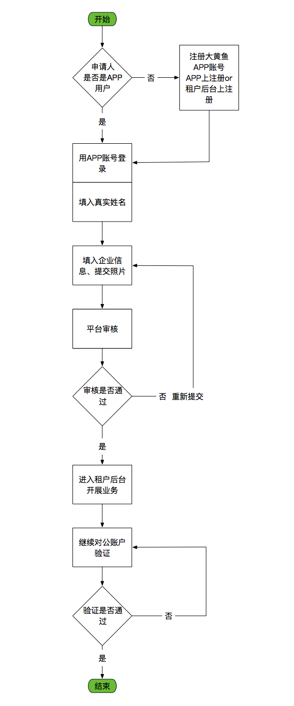

>### 租户入驻流程

**流程图**

(点击图像查看大图)
  

**功能设计**  
* 第1步 信息登记
  * 租户信息登记页面

(点击图像查看大图)
  
    * 用户从登录页面的“申请租户入驻”入驻转入时，用户处于未登录状态，显示此页面；
    * 页面中申请人必须填入真实姓名；
    * 未注册大黄鱼账号的用户可通过“立即注册”入口转入用户注册页面。详见[*登录*](zh登录.md)页面中的描述；
    * 用户登录如[*登录*](zh登录.md)页面一样，可选择扫码、密码和手机验证等方式登录；  
  * 已登录用户转入租户入驻申请时显示如下信息登记页面：

(点击图像查看大图)
  
    此时新入驻申请第一步操作仅需输入申请人姓名。
* 第2步 主体信息录入  
  * 主体信息录入页面如下：
  
(点击图像查看大图)
  
  * 此页面用于用户录入租户账号审核必须的信息，请按效果图中所示字段为准；
  * 用户录入信息时，应及时验证正确性。发现明显错误应及时提醒用户：
  
  * 图片内容在页面中呈现预览图像时，**必须保持原始图像宽高比，不要拉伸变形**；
  * 所有必须字段均填入正确内容后，方可点击“提交审核”按钮。