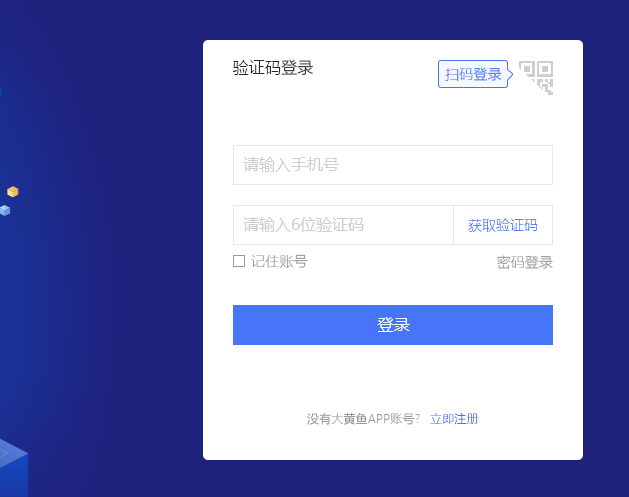

>### 租户入驻流程

**流程图**

(点击图像查看大图)
  

* 一个有合作意向的普通用户在平台商务人员引导下浏览群商官网大黄鱼主页，通过“租户后台”入口转入租户后台用户登录页面。

(点击图像查看大图)
  
  * 租户登录页面是大黄鱼租户后台的实际的首页
  * 页面提供大黄鱼App扫码登录功能。登录二维码有时效，超时后显示“失效”状态： 
  

  
  
  

  * 扫码登录失败时，页面须显示“失败”状态：
  

  

  * 页面提供账号密码登录功能，用户使用大黄鱼账号密码进行登录。用户可选择使用扫码登录或输入账号登录； 
  
(点击图像查看大图)
  
  * **大黄鱼登录账号通常是账号注册的手机号码**。登录页面提供“手机号+密码”和“手机号+验证码”两种验证方式，用户可切换：
  

  

  * 对于没有大黄鱼账号的用户，页面提供账号注册入口；
  * 页面提供“申请租户入驻”入口；
  * 页面提供下载大黄鱼App入口。用户也可以通过App进行账号注册操作。点击（或鼠标悬停）在该入口上，显示App下载二维码，用户通过手机扫码直接下载： 
  

  
  

* 在登录页面中用户点击“立即注册”标签，显示大黄鱼账号注册页面。

(点击图像查看大图)
  