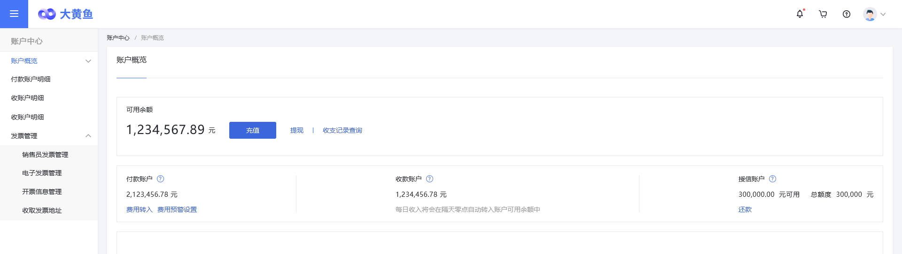
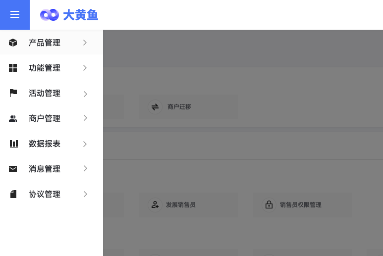

>### 租户后台页面框架说明  

租户后台前端基于H5网页开发。除登录页面外，所有页面采用统一的框架布局。如下图所示：

(点击图像查看大图)
   
* 页面顶端包含一个菜单按钮、大黄鱼平台Logo、平台名称、消息标签、购物车标签、帮助标签和用户头像按钮；
* 对应各子功能页面，页面框架左侧显示子功能模块菜单。菜单顶部为功能模块名称，无用户交互。其下方为菜单条目。菜单最多分为两级，具有子菜单的菜单项可收缩和展开；
* 页面主体为功能页面交互区域。其顶部须显示“面包屑”标签便于用户快速定位页面。设计要求所有功能页面中，所有数据表格都须提供刷新、设定分页记录数和分页跳转功能；所有具有查询、统计的数据表格都须提供数据导出功能（导出操作受用户权限限制）；
* 顶部菜单按钮点击后显示当前用户可操作的所有租户后台子功能列表菜单，如下图所示。此菜单的所有菜单项只有一级，点击后转入对应子功能主页面。   

 

  

* “消息”标签点击后转入当前用户的消息管理子功能页面。显示其接收到的各类消息，提供消息发送（若具有权限）功能；
* “购物车”标签点击后转入添加产品功能页面。其中显示平台产品列表，添加产品操作代表租户代理销售该产品。（此功能主要面向普通零售商品类别，当前版本暂不开发）；
* “帮助”标签点击后转入平台说明文档主页面。平台文档需平台研发后期编撰，当前版本暂不开发。
* 用户头像按钮在点击或鼠标悬停时显示账号基本信息菜单，菜单提供账号管理功能页入口。